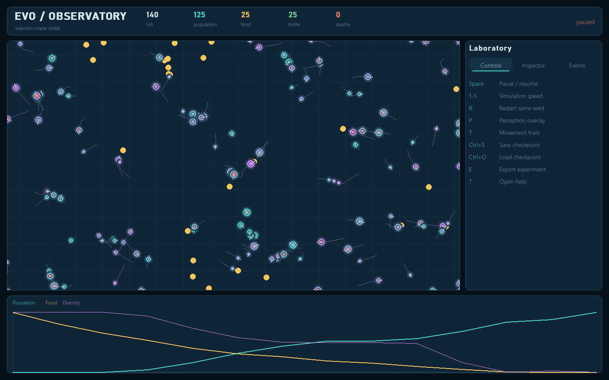
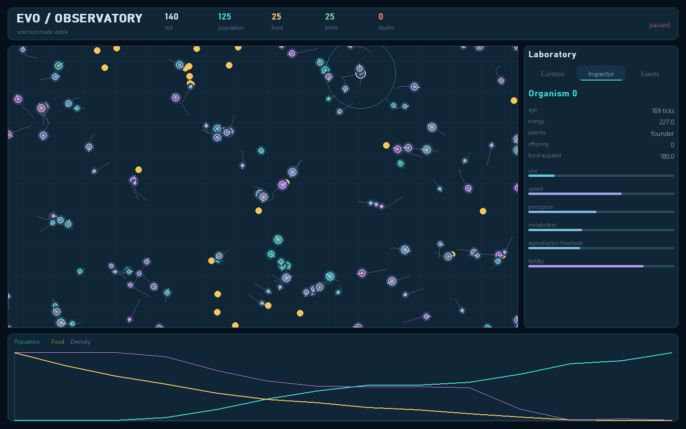
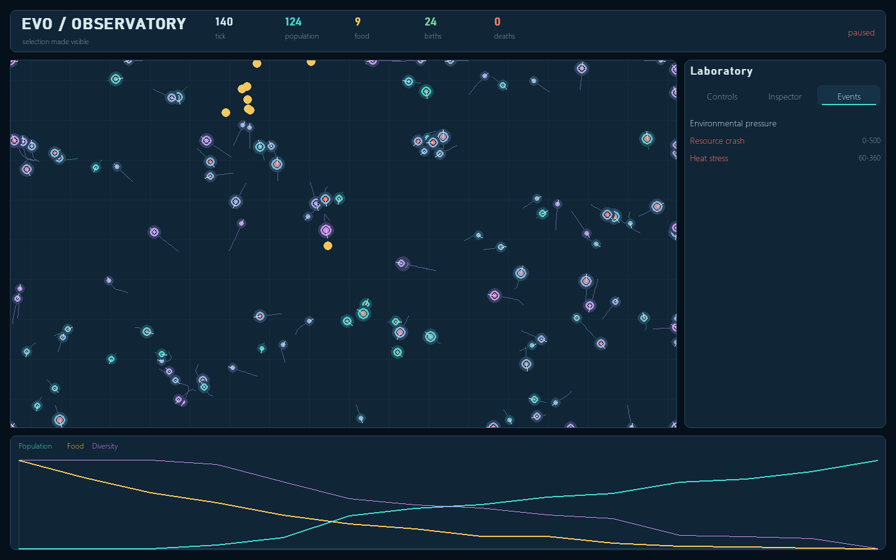

# EVO / Observatory



EVO / Observatory is a deterministic artificial-life laboratory. Autonomous organisms search for limited food, spend energy to move and survive, reproduce with crossover and mutation, age, die, and leave inspectable lineages. The same scientific engine powers the live Pygame interface and faster-than-real-time headless experiments.

The project makes evolution visible rather than hiding it behind one genetic-algorithm score. Natural survival and reproduction create selection pressure; analytics explain what happened without deciding who survives.

## What is included

- Continuous 2D ecosystem with 100 default founders and configurable world boundaries.
- Six bounded, inheritable quantitative traits with visible phenotype encodings.
- Seeded uniform/arithmetic crossover and Gaussian mutation.
- Food sensing, steering, collision boundaries, metabolism, movement costs, aging, death, mating, and lineage.
- Drought, abundance, and heat-pressure events with a visible timeline.
- Responsive Pygame laboratory with organism inspection, controls, trails, perception overlays, and live traces.
- Headless single runs, deterministic batches, and invariant-audited stress runs.
- Versioned atomic checkpoints that preserve the RNG and continue bit-for-bit.
- CSV/JSON exports and four publication-ready Matplotlib charts per experiment.
- Five reusable experiment scenarios and five generated example result packages.
- Automated unit, simulation, persistence, CLI, UI, reproducibility, stress, and documentation tests.

## Quick start on Windows

Requirements: Windows 10/11 and Python 3.12 or newer.

```powershell
cd C:\path\to\evolution-simulator
py -3.12 -m venv .venv
.\.venv\Scripts\python.exe -m pip install --upgrade pip
.\.venv\Scripts\python.exe -m pip install -e ".[dev]"
.\.venv\Scripts\python.exe main.py ui --config config/showcase.json --seed 2026
```

The first screen summarizes the seed and experiment. Press `Enter` to begin.

## Quick start on macOS or Linux

```bash
cd /path/to/evolution-simulator
python3.12 -m venv .venv
.venv/bin/python -m pip install --upgrade pip
.venv/bin/python -m pip install -e '.[dev]'
.venv/bin/python main.py ui --config config/showcase.json --seed 2026
```

Pygame-ce is the maintained Pygame-compatible runtime used by this project. No network service, database, or GPU is required.

## Interactive laboratory



Launch the default or showcase configuration:

```powershell
.\.venv\Scripts\python.exe main.py ui --config config/default.json --seed 2026
.\.venv\Scripts\python.exe main.py ui --config config/showcase.json --seed 2026
```

The visual encoding is scientific, not decorative:

- Organism radius corresponds to the size gene.
- Hue shifts from cyan toward violet as maximum speed rises.
- The inner disc moves from coral toward cyan with available energy.
- The heading needle shows velocity direction.
- Gold diamonds are food resources.
- A selected organism shows its perception radius, genome values, parents, offspring, food acquired, age, and energy.
- The bottom trace compares relative population, food, and diversity movement over the visible history.

### Controls

| Input | Action |
| --- | --- |
| `Enter` | Start from the setup screen |
| `Space` | Pause or resume |
| `1` through `5` | Select 1, 2, 4, 8, or 16 deterministic ticks per rendered frame |
| `R` | Restart with the same configuration and seed |
| `P` | Toggle the selected organism's perception overlay |
| `T` | Toggle movement trails |
| `Ctrl+S` | Save `exports/checkpoints/latest.json` atomically |
| `Ctrl+O` | Load the latest checkpoint |
| `E` | Export the current experiment |
| `?` or `Escape` | Toggle the help overlay |
| Left click | Select an organism or change sidebar tab |

Simulation speed changes how many identical fixed ticks run per frame. It never scales equations or changes outcomes for an equal tick count.

## Headless experiments

Validate a configuration:

```powershell
.\.venv\Scripts\python.exe main.py validate --config config/default.json
```

Run one scenario:

```powershell
.\.venv\Scripts\python.exe main.py run `
  --scenario experiments/scarcity.json `
  --output exports/scarcity `
  --seed 2202 `
  --ticks 7000
```

Run controlled replicates. Replicate seeds are the base seed plus the zero-based replicate index:

```powershell
.\.venv\Scripts\python.exe main.py batch `
  --scenario experiments/mutation_high.json `
  --output exports/mutation-high-batch `
  --replicates 5 `
  --ticks 6000
```

Run the required long-duration invariant audit:

```powershell
.\.venv\Scripts\python.exe main.py stress `
  --config config/default.json `
  --ticks 100000 `
  --seed 2026
```

Add `--help` after the program or any command to see its exact options.

## Scientific model

Each organism has the real-valued genome

```text
G = [size, speed, perception, metabolism, reproduction_threshold, fertility]
```

| Trait | Default bounds | Consequence |
| --- | ---: | --- |
| `size` | 2.5–8.0 | Larger visible body and higher basal/movement cost; larger eating reach |
| `speed` | 0.5–4.0 | Faster pursuit with an increasing movement cost |
| `perception` | 25–150 | Larger food-search radius with no guaranteed reward |
| `metabolism` | 0.65–1.5 | Higher efficiency reduces basal energy cost |
| `reproduction_threshold` | 70–150 | Energy needed before mating is possible |
| `fertility` | 0.15–0.55 | Higher investment shortens the effective reproduction cooldown |

### Mutation

Each gene mutates independently with probability `p_mutation`:

```text
g' = clamp(g + Normal(0, sigma × gene_span), minimum, maximum)
```

Using a fraction of each gene's configured span makes one mutation-strength value meaningful across traits with different units.

### Crossover

Uniform crossover chooses each child gene from one parent. Arithmetic crossover samples an independent `alpha` for each gene:

```text
child_gene = alpha × parent_a + (1 - alpha) × parent_b
```

Mutation is applied after crossover. All random choices use the engine's single NumPy `Generator(PCG64)` instance.

### Energy

For each fixed tick:

```text
basal = basal_cost × (1 + size / 8) / metabolism × environment_multiplier
movement = movement_cost × distance × (0.5 + size / 8) × (0.5 + speed / 4)
energy' = min(max_energy, energy + food_gain - basal - movement - reproduction_cost)
```

This creates trade-offs. More speed or size can secure food, but costs more energy. Perception reveals resources but does not guarantee that the organism reaches them first.

### Selection and fitness

No fixed score selects survivors. Organisms that acquire enough energy, live long enough, and find an eligible nearby mate reproduce. Starvation and maximum age remove organisms. The reported analytical fitness is only:

```text
100 × offspring + 0.01 × age + 0.5 × food_acquired
```

The engine never reads that value.

See [the complete scientific model](docs/SCIENTIFIC_MODEL.md) for tick ordering, determinism, lineage, event semantics, statistics, and interpretation limits.

## Exact tick cycle

1. Reset per-tick counters and apply scheduled environmental events.
2. Accumulate and spawn food deterministically.
3. Build the food spatial index.
4. Sense food, steer, move, resolve boundaries, and deduct costs.
5. Resolve food contention by distance and then stable creature ID.
6. Pair eligible nearby organisms in stable order.
7. Apply crossover and mutation; record both parents and deduct investment.
8. Remove organisms with exhausted energy or excessive age.
9. Advance the tick and record metrics at the configured interval.

The renderer is not part of this cycle.

## Environment events



Scenarios can schedule:

- `drought`: multiplies food regeneration by an intensity below 1.
- `abundance`: multiplies food regeneration by an intensity above 1.
- `heat`: multiplies basal metabolism cost.
- `redistribute`: reserved in the event schema for spatial-distribution studies; it is recorded but does not alter base equations in v1.0.

Events use half-open intervals: `start_tick <= tick < start_tick + duration`. Their history is exported exactly once.

## Included experiments and example results

The versioned scenarios live in `experiments/`. Generated 900-tick reference runs live in `examples/results/`. They are single seeded demonstrations, not claims of statistical significance.

| Example | Seed | Final population | Births | Deaths | Diversity | Purpose |
| --- | ---: | ---: | ---: | ---: | ---: | --- |
| Baseline | 1101 | 179 | 106 | 27 | 0.8608 | Stable-supply control |
| Scarcity | 2202 | 136 | 85 | 49 | 0.9309 | Sustained food pressure |
| Mutation low | 3303 | 170 | 105 | 35 | 0.8850 | Low-variation control |
| Mutation high | 3303 | 172 | 102 | 30 | 0.8955 | Higher mutation treatment |
| Environmental shift | 4404 | 204 | 165 | 61 | 0.8743 | Drought, heat, and recovery |

The mutation pair intentionally shares a seed. In this one reference run, the high-mutation treatment ended with slightly higher normalized pairwise genome diversity; use several replicates before drawing conclusions.

Detailed hypotheses, controls, and analysis guidance are in [EXPERIMENTS.md](docs/EXPERIMENTS.md).

## Export package

Every headless run and manual UI export creates:

| File | Contents |
| --- | --- |
| `config.json` | Effective configuration and seed |
| `metrics.csv` | Population, vital events, diversity, fitness, trait moments, and correlations over time |
| `creatures.csv` | Final organism state and all genes |
| `lineage.csv` | Child, both parents, and birth tick |
| `events.json` | Scheduled environmental events and activation history |
| `summary.json` | Canonical final result and invariant audit |
| `population.png` | Population and resource time series |
| `traits.png` | Normalized mean-trait time series |
| `births_deaths.png` | Vital events by metric sample |
| `distributions.png` | Final six-trait histograms |

CSV and JSON are intentionally ordinary formats so the results can be opened in Excel, Python, R, or a notebook without a project-specific reader.

## Save and load

Checkpoints are versioned JSON and contain:

- effective configuration and seed;
- complete creature/resource state;
- lineage and metrics history;
- environmental schedule/history;
- all counters and fractional food-spawn remainder;
- the NumPy bit-generator state.

Writes use a temporary sibling plus `os.replace`, so an interrupted save does not replace the last valid checkpoint. Loading validates the entire candidate before returning a new engine. Corrupt, non-finite, or incompatible files do not modify the running session.

## Architecture

```text
src/evolution_sim/
├── config.py                 validated immutable configuration
├── model/
│   ├── genome.py             six-gene value object
│   ├── genetics.py           crossover and mutation
│   ├── entities.py           creatures and resources
│   ├── lineage.py            ancestry graph
│   ├── math2d.py             vector operations
│   └── spatial.py            deterministic uniform grid
├── simulation/
│   ├── engine.py             fixed-tick lifecycle
│   ├── environment.py        scheduled pressure
│   └── snapshots.py          immutable UI boundary
├── analytics/metrics.py      observational statistics
├── io/
│   ├── checkpoints.py        atomic continuation state
│   └── export.py             CSV/JSON package
├── experiments/
│   ├── runner.py             single/batch/stress modes
│   ├── scenarios.py          scenario loading/overrides
│   └── charts.py             static Matplotlib evidence
├── ui/
│   ├── app.py                event loop and commands
│   ├── renderer.py           world and laboratory panels
│   ├── charts.py             live traces
│   ├── layout.py             responsive geometry
│   ├── theme.py              visual tokens/type
│   └── widgets.py            drawing primitives
└── cli.py                    command-line interface
```

Dependencies point inward: UI and exports read the engine; the engine never imports UI. See [ARCHITECTURE.md](docs/ARCHITECTURE.md) for boundaries and extension points.

## Configuration

Start from `config/default.json` or `config/showcase.json`. Every field is validated; unknown keys, invalid ranges, NaN, and Infinity are rejected with a dotted field name.

Scenario files add:

```json
{
  "name": "scarcity",
  "description": "A sustained drought exposes energy trade-offs.",
  "config": "../config/default.json",
  "seed": 2202,
  "ticks": 7000,
  "overrides": {},
  "events": [
    {
      "kind": "drought",
      "start_tick": 1800,
      "duration": 4200,
      "intensity": 0.22,
      "label": "Sustained drought"
    }
  ]
}
```

`overrides` is a deep merge over the referenced configuration, so a treatment can change only mutation settings while keeping every other control identical.

## Tests and verification

Run everything:

```powershell
.\.venv\Scripts\python.exe -m pytest -q
```

Run fast checks without long performance gates:

```powershell
.\.venv\Scripts\python.exe -m pytest -m "not slow" -q
```

Run only stress/performance gates:

```powershell
.\.venv\Scripts\python.exe -m pytest -m slow -q
```

Lint and check formatting:

```powershell
.\.venv\Scripts\python.exe -m ruff check .
.\.venv\Scripts\python.exe -m ruff format --check .
```

The slow suite includes a 100,000-tick invariant audit and an interactive-budget benchmark for 100 default founders. Determinism tests compare complete snapshots after environmental shifts and after checkpoint continuation.

## Reproducibility rules

For equivalent results, keep package version, effective configuration, seed, number of ticks, event schedule, and numerical platform equal. No wall-clock input enters simulation state. Entity conflicts use stable IDs. A canonical `summary.json` omits timestamps and output paths, so equivalent runs are byte-comparable.

## Performance model

- Food and mate neighborhoods use a deterministic uniform spatial hash.
- The food index is built once per tick and shared by movement and consumption.
- Diversity uses a deterministic bounded sample when the population is large.
- Rendering can run multiple fixed ticks per frame without changing equations.
- Headless mode skips all Pygame work.

Performance depends on population, food count, sampling interval, and scenario pressure. Population caps protect the process from unbounded reproduction.

## Troubleshooting

### PowerShell blocks activation

Activation is optional. Run the environment's interpreter directly:

```powershell
.\.venv\Scripts\python.exe main.py --help
```

### The Pygame window does not open

- Confirm a desktop session is available.
- Update the environment with `python -m pip install -e ".[dev]"`.
- On remote/headless machines, use `run`, `batch`, or `stress` rather than `ui`.

### A run becomes extinct

Extinction is a valid scientific outcome. Export it, inspect food and energy traces, then increase initial food/spawn rate or reduce pressure. The program does not crash or silently repopulate.

### A checkpoint does not load

The error identifies corruption, a non-finite value, or an unsupported version. The current session remains untouched. Do not hand-edit RNG state unless you understand NumPy's bit-generator schema.

### Charts look flat

Increase tick count or decrease `metrics.sample_interval`. Very short experiments may not include enough generations to reveal trait shifts.

## Demonstration

Use [DEMO_SCRIPT.md](docs/DEMO_SCRIPT.md) for a rehearsed 3–5 minute showcase: establish the baseline, accelerate, apply pressure, inspect one organism and its lineage, then open the exported before/after evidence.

## Scope

Version 1.0 intentionally does not include neural-network brains, predators, speciation, disease, multiplayer, photorealistic graphics, or molecular genetics. The engine boundaries allow those to be added without making rendering determine evolution.

## License

MIT. See [LICENSE](LICENSE).
