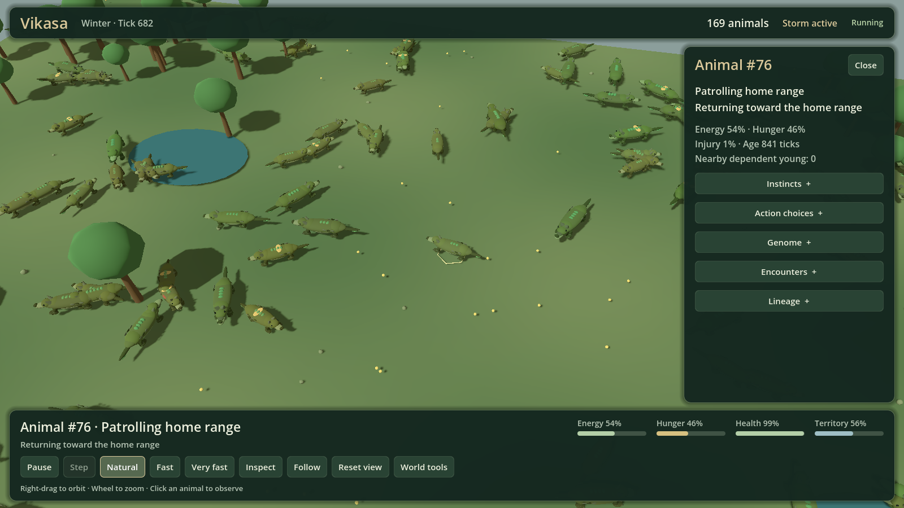
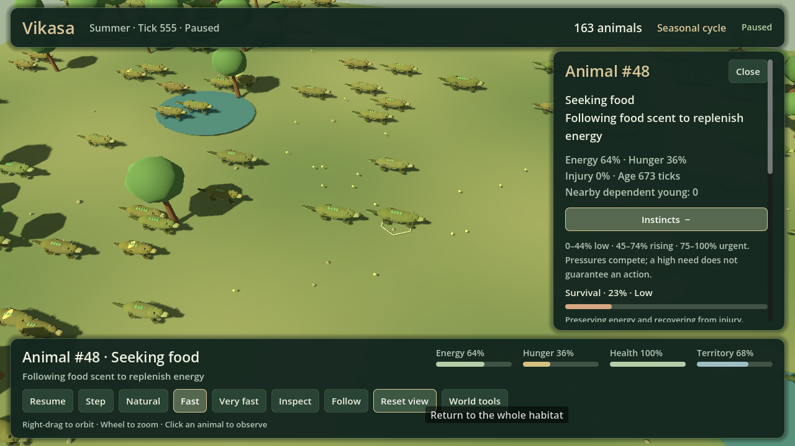

# Vikasa — Living Biome

Vikasa is a deterministic artificial-life sandbox. Watch small wild creatures forage, rest, flee, seek mates, care for young, patrol a home range, and sometimes challenge a rival. Their decisions emerge from changing needs and local opportunities; the interface exposes the action and its reason so the habitat stays readable rather than becoming a wall of statistics.



The Python simulation engine is authoritative. The Godot 4 client renders a procedural 3D habitat and sends observation/control commands to a loopback-only bridge. A Pygame lab and headless CLI remain available. This is an explanatory toy model—not a forecast for a real species.

## Recommended launch: 3D Living Biome

Requires Python 3.12+, Godot 4, and a desktop capable of running the Godot renderer. From the repository root:

```powershell
py -3.12 -m venv .venv
.\.venv\Scripts\python.exe -m pip install --upgrade pip
.\.venv\Scripts\python.exe -m pip install -e ".[dev]"
.\.venv\Scripts\vikasa.exe godot --config config\showcase.json --seed 2026
```

On macOS/Linux, use `python3.12`, `.venv/bin/python`, and `.venv/bin/vikasa` in the equivalent commands. If Godot is not discoverable, set `VIKASA_GODOT_BINARY` or pass `--godot-path` to the `godot` command. For a manually opened Godot editor, start the bridge with `.venv/Scripts/vikasa.exe serve --config config/showcase.json --seed 2026`, then open `godot/project.godot`.

### Observe and control

- Click a creature to open its readable profile: current action and reason, energy, hunger, injury, instincts, top action choices, genes, encounters, satisfaction, and lineage.
- Use **Follow** to track the selected animal; **Reset view** returns to the whole habitat. Right-drag orbits, and the wheel zooms.
- **Space** pauses/resumes. **Step** advances one tick while paused. **Natural**, **Fast**, and **Very fast** set 8, 24, or 60 simulation ticks per second.
- **World tools** can place a food patch at a clicked world position or schedule bloom, drought, heat, storm, or wildfire pressure. These are experiments, not interventions in a real ecosystem.
- **Escape** cancels placement/closes a panel. The HUD reports offline state and clears stale creature data if the bridge disconnects.



The model tracks six drives—survival, foraging, mating, offspring care, danger avoidance, and territory. They are competing normalized pressures, not human feelings. Expand **Instincts** to read each one and **Action choices** to inspect the leading perceived utilities. An urgent danger can preempt the highest score; otherwise hysteresis and seeded near-tie choice reduce jitter. The exact model and its caveats are in [the scientific model](docs/SCIENTIFIC_MODEL.md) and [the mathematics reference](docs/MATHEMATICS.md).

## Pygame laboratory

```powershell
.\.venv\Scripts\vikasa.exe ui --config config\showcase.json --seed 2026
```

The 2D laboratory has a launch configurator, presets, organism selection, traits/lineage inspection, trails, perception overlays, and charts. `Enter` launches; `Space` pauses; `1`–`5` choose 1, 2, 4, 8, or 16 ticks per rendered frame; `R` restarts with the same seed; `C` opens setup; `P` toggles perception; `T` toggles trails; `Ctrl+S` saves a checkpoint; `Ctrl+O` loads it; `E` exports; `?` or `Escape` opens help. Speed changes ticks per frame, not the equations.

## What the simulation actually includes

- Six bounded body genes, crossover, mutation, and three inherited behavioral tendencies (aggression, resilience, sociability).
- Foraging and resource competition, energy costs, accumulated starvation, aging, mating, offspring, and lineage.
- Six drives arbitrated among eight actions: explore, forage, rest, seek mate, care, flee, patrol, and challenge.
- Small home ranges, local hazard/threat perception, intermittent low-probability fights, injury, occasional fatal outcomes, and alpha status after victory.
- Satisfaction summarizes energy security, offspring history, food acquired, and fights won. Its fight-wins component modestly raises repeat-challenge utility and the still-low encounter chance; satisfaction is not a universal fitness objective.
- Seasonal food/temperature/rainfall signals and scheduled drought, abundance, heat, cold, storm, flood, wildfire, and disease pressure.
- A small cultural-tradition mechanic: repeated shared cues can found named beliefs and rituals. This is not language, theology, reflective religion, or guaranteed emergence.
- Seeded experiments, invariant audits, CSV/JSON evidence, atomic checkpoints, and a deterministic live bridge.

## Headless experiments

Validate a config, run one scenario, run seeded replicates, or perform a long invariant audit:

```powershell
.\.venv\Scripts\vikasa.exe validate --config config\showcase.json
.\.venv\Scripts\vikasa.exe run --scenario experiments\scarcity.json --output exports\scarcity --seed 2202 --ticks 7000
.\.venv\Scripts\vikasa.exe batch --scenario experiments\mutation_high.json --output exports\mutation-high --replicates 5 --ticks 6000
.\.venv\Scripts\vikasa.exe stress --config config\showcase.json --ticks 100000 --seed 2026
```

All commands accept `--help`. Scenario/config files are the protocol; use matched settings and multiple seeds before interpreting a treatment. Read [experiment recipes](docs/EXPERIMENTS.md) and [the demonstration walkthrough](docs/DEMO_SCRIPT.md).

## Limitations

Ticks have no calibrated real-time meaning. Space is two-dimensional in the engine even when the renderer presents terrain in 3D. There is no food web, sex differentiation, genetic drift calibration, explicit disease transmission, hydrology, learned language, or validated real-species parameterization. Combat, starvation, inheritance, environment, and culture are intentionally simplified rules; plausible-looking animation does not validate them. A belief group may arise through the implemented cue/ritual rules, but users should not interpret that as the simulation independently developing human-like religion.

Additional implementation contracts live in [architecture](docs/ARCHITECTURE.md), [scientific model](docs/SCIENTIFIC_MODEL.md), and [mathematics](docs/MATHEMATICS.md). Project history and accepted current design: [wildlife experience spec](docs/superpowers/specs/2026-10-05-vikasa-wildlife-experience-design.md) and [implementation plan](docs/superpowers/plans/2026-10-05-vikasa-wildlife-experience.md).
