# Vikasa — Living Biome

[Visual evidence and graph-reading guide](#visual-evidence-and-how-to-read-the-graphs) · [Mathematics PDF](output/pdf/Vikasa_Mathematics_Guide.pdf) · [Desktop setup](#run-the-3d-living-biome)


[Compact-window screenshot](docs/images/research-evolution-compact.png). The observatory scrolls on smaller screens; unavailable legacy measurements are not plotted as zero.

The [spatial ecology research profile](docs/SPATIAL_ECOLOGY.md) adds finite plant reserves,
soil-water dynamics, an interactive cell map, and auditable natural/external food inputs.
It is available through `--config config/spatial-biome.json`; the sustained showcase
remains the default pending long-horizon validation of this new model.

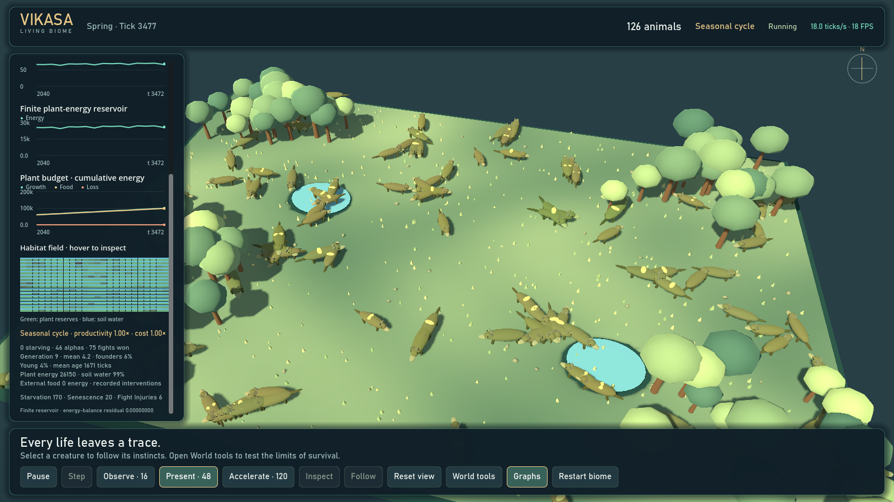

The [6,000-tick spatial study](docs/results/spatial-biome-study-6000-2026-10-08.json)
recorded deepest living ancestral generations of 11–16 across three selected seeds, with 297–381 deaths
per run and no recorded invariant failures. This is finite-horizon exploratory
evidence, not a guarantee of survival or proof of adaptation.

The research upgrade is underway: sustained replacement, age-dependent mortality,
generational development and inspectable quantitative evolution are implemented.
See [current evidence and the full remaining scope](docs/RESEARCH_STATUS.md).

The [controlled experiment laboratory](docs/CONTROLLED_EXPERIMENTS.md) compares
baseline, drought and storm conditions across complete seed blocks. It exports an
offline interactive viewer with development curves, paired effects, uncertainty,
every replicate and inspectable provenance. Run the preview from the repository root:

```powershell
.\.venv\Scripts\python.exe -m evolution_sim.cli contrast --protocol experiments/weather-contrast-preview.json --output exports/weather-preview
Start-Process (Resolve-Path exports/weather-preview/index.html).Path
```

Use a new output directory for each run; on macOS/Linux use `.venv/bin/python`
and the platform opening commands in the guide. This observer does not reset the
separately running 3D world or silently discard extinct/failed seeds.

[Measured nine-run weather preview](docs/results/weather-laboratory-2026-10-08/report.json):
baseline finished with 160–175 living animals; drought with 22–24; the configured
severe storm caused extinction at ticks 348–370. These are short-horizon model
counterfactuals, not empirical validation. [See the actual interactive viewer screenshot](docs/images/controlled-experiments.jpg).

Vikasa is a deterministic artificial-life sandbox. Watch small wild creatures forage, rest, flee, seek mates, care for young, patrol a home range, and sometimes challenge a rival. Their decisions emerge from changing needs and local opportunities; the interface exposes the action and its reason so the habitat stays readable rather than becoming a wall of statistics.


The Python simulation engine is authoritative. The Godot 4 client renders a procedural 3D habitat and sends observation/control commands to a loopback-only bridge. A Pygame lab and headless CLI remain available. This is an explanatory toy model—not a forecast for a real species.

## Run the 3D Living Biome

The interactive 3D GUI runs on desktop Windows, macOS, and Linux. It requires Python 3.12 or newer, Godot 4, and a graphics-capable desktop; this repository does not currently provide an Android or iOS app. The commands below assume you already have a Vikasa source checkout and run them from its root directory (the one containing `pyproject.toml`).

### Windows (PowerShell)

Install Godot 4 if it is not already installed, then create the environment, install Vikasa, and launch the 3D client:

```powershell
winget install --id GodotEngine.GodotEngine --exact --scope user
py -3.12 -m venv .venv
.\.venv\Scripts\python.exe -m pip install --upgrade pip
.\.venv\Scripts\python.exe -m pip install -e .
.\.venv\Scripts\vikasa.exe godot --config config\showcase.json --seed 2026
```

The launcher detects a per-user WinGet Godot installation. To create or refresh a desktop shortcut for this checkout, run:

```powershell
.\.venv\Scripts\vikasa.exe shortcut --config config\showcase.json --seed 2026
```

### macOS (Terminal)

With Homebrew installed, run:

```bash
brew install python@3.12
brew install --cask godot
python3.12 -m venv .venv
source .venv/bin/activate
python -m pip install --upgrade pip
python -m pip install -e .
vikasa godot --config config/showcase.json --seed 2026 --godot-path /Applications/Godot.app/Contents/MacOS/Godot
```

### Linux (Ubuntu 24.04+, Terminal)

This copy/paste path uses Ubuntu's Python 3.12 packages and Godot's Flathub build. Run the first block once, then keep the first terminal open while the GUI runs in a second terminal:

```bash
sudo apt update
sudo apt install -y python3.12 python3.12-venv flatpak
flatpak remote-add --user --if-not-exists flathub https://flathub.org/repo/flathub.flatpakrepo
flatpak install --user -y flathub org.godotengine.Godot
python3.12 -m venv .venv
source .venv/bin/activate
python -m pip install --upgrade pip
python -m pip install -e .
```

Terminal 1 — start the simulation bridge from the repository root:

```bash
source .venv/bin/activate
vikasa serve --config config/showcase.json --seed 2026
```

Terminal 2 — from the same repository root, launch the Godot GUI:

```bash
flatpak run org.godotengine.Godot --path "$PWD/godot"
```

On other Linux distributions, install Python 3.12 (including its `venv` support) and Flatpak with that distribution's package manager, then use the same setup and two-terminal commands. Godot must be able to read the checkout's `godot/` directory. The Pygame 2D lab remains available on all three desktop platforms with `vikasa ui --config config/showcase.json --seed 2026` (Windows: `.\.venv\Scripts\vikasa.exe ui --config config\showcase.json --seed 2026`).

For direct GUI launch on Windows or macOS, the `godot` command starts the Python simulation bridge and Godot client together. If Godot is installed outside the automatic search locations, supply its executable with `--godot-path` or set `VIKASA_GODOT_BINARY`.

### Screenshots

| Live Observatory | Storm and population loss |
| --- | --- |
|  |  |

| Genetic trends | Creature profile |
| --- | --- |
|  |  |

These are real seeded bridge states, including an explicitly applied storm. See the current [960×600 layout](docs/images/presentation-compact.png). Earlier captures remain in `docs/images/` for reference.

### Observe and control

- Click a creature to open its readable profile: current action and reason, energy, hunger, injury, instincts, top action choices, genes, encounters, satisfaction, and lineage.
- Use **Follow** to track the selected animal; **Reset view** returns to the whole habitat. Right-drag orbits, and the wheel zooms.
- **Space** pauses/resumes; **Step** advances one tick while paused. **Observe · 16**, **Present · 48**, and **Accelerate · 120** request those tick rates. Present is the default; the HUD displays actual speed. Excess catch-up work is discarded on slower hardware. With the complete 3D window open, this Intel Iris Xe development laptop sustained about 43 ticks/second in a 12-second Accelerate sample; this is an example, not a guarantee for all devices.
- **Graphs** toggles the Observatory. **Population**, **Survival**, **Genetics**, and **Evolution** show real engine histories; hover to inspect values at a tick. Evolution shows generational depth, founder replacement and signed birth-cohort Price decomposition. Shaded periods show weather exposure. Birth/death totals retain outcomes between GUI polls.
- **World tools** offers drought, heat, storm, wildfire, cold, disease, a food bloom, and food placement. Adjust pressure and duration, then **Apply weather**. Drought intensity is food growth retained (lower is harsher); other hazards strengthen as intensity increases. Default duration is 160 ticks.
- **Restart biome** resets the population and histories with the same seed after an experiment or extinction.
- **Escape** cancels placement/closes a panel. The HUD reports offline state and clears stale creature data if the bridge disconnects.


The model tracks six drives—survival, foraging, mating, offspring care, danger avoidance, and territory. They are competing normalized pressures, not human feelings. Expand **Instincts** to read each one and **Action choices** to inspect the leading perceived utilities. An urgent danger can preempt the highest score; otherwise hysteresis and seeded near-tie choice reduce jitter. The exact model and its caveats are in [the scientific model](docs/SCIENTIFIC_MODEL.md) and [the mathematics reference](docs/MATHEMATICS.md).

The client uses shared meshes, one simple body shadow per visible animal, static habitat shadows, instanced vegetation, a 30 FPS ceiling, at most 180 visible creatures and 240 food patches, and bounded chart histories. The full population lives in Python; drawing alone is capped. Above 40 creatures, decisions are deterministically staggered across six ticks while movement, hunger, consumption, births and deaths advance every tick. Combat opportunities are checked every four ticks. Completed GUI snapshots publish about six times/second, so polling does not wait for a simulation tick. Diversity analysis is vectorized.

The showcase starts with 64 founders in a 720×480 habitat and a cap of 180. It uses seeded age-dependent mortality, viable feeding/encounter density and larger newborn reserves for sustained generational replacement. The 12,000-tick maximum age is a hard ceiling, not an expected lifespan. Animals still die from scarcity, fights, senescence and exposure; nothing respawns them. The previous extinction-prone configuration is preserved as `config/extinction-control.json`. See [research status and remaining work](docs/RESEARCH_STATUS.md). These coefficients remain illustrative rather than calibrated to a real species.

## Reproducible development studies

Spatial lookup now batches validation and uses copied scalar coordinates. See
[performance evidence and copy-paste benchmark commands](docs/PERFORMANCE.md).
Measured tick rate—not the requested speed—is the presentation-speed indicator;
120 ticks/s is a ceiling, not a hardware-independent guarantee.

Measure renewal across seeds rather than judging one short GUI run:

```powershell
.\.venv\Scripts\python.exe -m evolution_sim.cli study --config config/showcase.json --seeds 2026 7 41 --ticks 12000 --output exports/development-study.json
.\.venv\Scripts\python.exe -m evolution_sim.cli study --config config/extinction-control.json --seeds 2026 7 41 --ticks 12000 --output exports/extinction-control-study.json
```

The report retains extinct runs, exact extinction times, generation trajectories,
invariant checks, configuration/source hashes and a Wilson survival interval.
This can take several minutes. It is exploratory evidence, not species validation.
Experiment exports also include `evolution.json` (the last 512 birth cohorts) and
generation depth in `creatures.csv`.

## Pygame laboratory

```powershell
.\.venv\Scripts\vikasa.exe ui --config config\showcase.json --seed 2026
```

The 2D laboratory has a launch configurator, presets, organism selection, traits/lineage inspection, trails, perception overlays, and charts. `Enter` launches; `Space` pauses; `1`–`5` choose 1, 2, 4, 8, or 16 ticks per rendered frame; `R` restarts with the same seed; `C` opens setup; `P` toggles perception; `T` toggles trails; `Ctrl+S` saves a checkpoint; `Ctrl+O` loads it; `E` exports; `?` or `Escape` opens help. Speed changes ticks per frame, not the equations.

## What the simulation actually includes

- Six bounded body genes, crossover, mutation, and three inherited behavioral tendencies (aggression, resilience, sociability).
- Foraging and resource competition, energy costs, accumulated starvation, aging, mating, offspring, and lineage.
- Six drives arbitrated among eight actions: explore, forage, rest, seek mate, care, flee, patrol, and challenge.
- Small home ranges, local hazard/threat perception, intermittent low-probability fights, injury, occasional fatal outcomes, and alpha status after victory.
- Satisfaction summarizes energy security, offspring history, food acquired, and fights won. Its fight-wins component modestly raises repeat-challenge utility and the still-low encounter chance; satisfaction is not a universal fitness objective.
- Seasonal food/temperature/rainfall signals and scheduled drought, abundance, heat, cold, storm, flood, wildfire, and disease pressure.
- A small cultural-tradition mechanic: repeated shared cues can found named beliefs and rituals. This is not language, theology, reflective religion, or guaranteed emergence.
- Seeded experiments, invariant audits, CSV/JSON evidence, atomic checkpoints, and a deterministic live bridge.

## Headless experiments

Validate a config, run one scenario, run seeded replicates, or perform a long invariant audit:

```powershell
.\.venv\Scripts\vikasa.exe validate --config config\showcase.json
.\.venv\Scripts\vikasa.exe run --scenario experiments\scarcity.json --output exports\scarcity --seed 2202 --ticks 7000
.\.venv\Scripts\vikasa.exe batch --scenario experiments\mutation_high.json --output exports\mutation-high --replicates 5 --ticks 6000
.\.venv\Scripts\vikasa.exe stress --config config\showcase.json --ticks 100000 --seed 2026
```

All commands accept `--help`. Scenario/config files are the protocol; use matched settings and multiple seeds before interpreting a treatment. Read [experiment recipes](docs/EXPERIMENTS.md) and [the demonstration walkthrough](docs/DEMO_SCRIPT.md).

## Individual variation, not only averages

Exports now include hashed `trait-space.json` and `trait_space.png`: individuals
colored by generation, six-trait correlations and the PCA variance spectrum.
These are export-time snapshots, not a live Godot panel. See
[commands and mathematical interpretation](docs/TRAIT_GEOMETRY.md).


## Visual evidence and how to read the graphs

This gallery brings the existing screenshots, exported figures and PDF into one
place. Images are stored in the repository, not the ignored local `exports/`
folder. Click an image to open it at full resolution. These are **recorded
snapshots**, not live counters: screenshots from different dates/profiles must
not be read as consecutive frames of one experiment.

### Start here: axes, units and honest interpretation

- **Ticks** are discrete engine steps, not seconds or days. Requested tick speed
  is a processing target; actual tick speed depends on hardware and population.
- **Counts** mean animals, food patches or events as labelled. Food-patch count
  is not the same quantity as food energy or plant biomass.
- **Normalized traits** use `(value − configured minimum) / configured span`.
  A value of 0.8 means 80% through that trait's allowed range, not 80% fitness.
- **A living-population mean** changes when animals are born or die as well as
  when inheritance changes. A rising line alone does not prove adaptation.
- **Missing measurements** are unavailable, not zero. After extinction,
  population is genuinely zero but living-population trait statistics are undefined.
- **Weather shading** marks exposure, not proof that the weather caused every
  change. Matched seed-blocked comparisons below provide a stronger model test.

### 1. Desktop observatory: development and evolutionary accounting


Read the **Generational development** graph from left to right: its horizontal
axis is tick, and the vertical axis is ancestral generation depth. Founders are
generation 0; a child is one plus the deepest parent's generation. The deepest
living generation is not the number of animals or a measure of intelligence.
The mean gives the whole living population's average depth. Deepest living depth
can fall when the deepest descendant dies.

The signed **Size · birth-cohort Price equation** graph separates the difference
between mean newborn size and the entire living pre-birth population's mean into
**selection** and **transmission** components. Positive values point toward
larger newborn size; negative values toward smaller size. Transmission includes
the implemented inheritance/mutation rules. The components sum to the cohort
change; this accounting identity is not a causal estimate of adaptation. Points
are birth cohorts, not arbitrary continuous observations.

**Population renewal** shows the fractions of living animals that are original
founders and that are young. A falling founder fraction with continued births
indicates replacement, not necessarily population growth. Hover a live chart to
inspect stored values. [Smaller-window version](docs/images/research-evolution-compact.png)
shows the same information in a scrolling panel.

The other live graph groups answer different questions:

| Live graph | Axes and interpretation |
| --- | --- |
| Population & food | Tick versus counts of living animals and food patches. A patch is not a fixed quantity of energy. |
| Life & loss · cumulative | Tick versus all births/deaths since the run began. These lines never decrease within one run; restart begins new totals. |
| Energy & injury / Reserves & exposure | Tick versus population-mean reserve fraction and injury, displayed as percentages. High energy is not the same as a high animal count; injury is not a mortality count. |
| Temperature & rainfall | Tick versus normalized environmental signals. These are model indices, not degrees Celsius or millimetres. |
| Food & metabolic pressure | Tick versus multipliers. Food below 1× reduces production relative to the model baseline; metabolic cost above 1× increases expenditure. Read health/exposure and resource reserves as well to understand losses. |
| Inherited size & speed | Tick versus raw trait means. Their physical units differ; compare each line with itself rather than treating a taller line as a better trait. |
| Genetic diversity | Tick versus the model's normalized summary of trait variation. It is not locus heterozygosity, a species count or heritability. |

The client retains bounded histories, so the displayed window is not necessarily
the whole run. Hover gives recorded values; lines between samples are visual
connections, not additional measurements.

### 2. Spatial ecology: the resource budget behind survival


The habitat map is an engine-cell view, not a photograph of terrain. Inspect a
cell in the live client to distinguish its plant reserves and soil water.
**Plants** and **Water** are normalized reservoir measurements; **Plant energy**
is the remaining finite energy available for natural food production.
The cumulative budget traces total growth, food harvest and weather loss.
These are accumulated flows, whereas plant energy is a current stock. Growth
must replenish harvest/loss for reserves to persist; comparing their heights
without that stock/flow distinction is misleading. The reported balance residual
checks the resource accounting, not biological realism.

The [three-seed spatial study](docs/results/spatial-biome-study-6000-2026-10-08.json)
records 6,000 ticks per seed; its recorded 11–16 deepest living generations and
297–381 deaths are finite-horizon results. [Full resource equations](docs/SPATIAL_ECOLOGY.md).

### 3. Weather laboratory: compare conditions, not just one dramatic screenshot

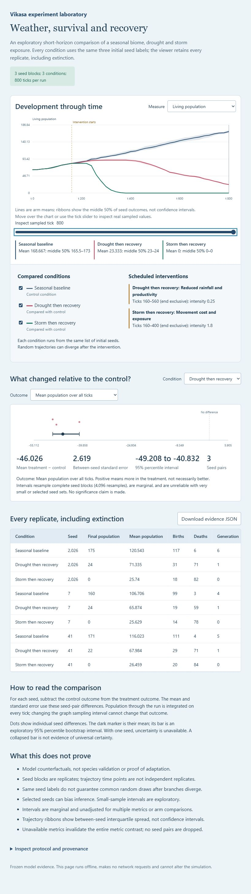

Select population, generation depth, plant energy, water or animal energy in
the [archived interactive viewer](docs/results/weather-laboratory-2026-10-08/index.html).
Download/open the HTML locally if GitHub displays its source instead of running
it. It works offline; the adjacent [report JSON](docs/results/weather-laboratory-2026-10-08/report.json)
retains the numbers behind the curves.

The horizontal axis is tick; the vertical axis follows the selected outcome.
Each condition line is the mean across the three selected seeds. The ribbons
show between-seed quartiles, **not confidence intervals**. Intervention markers
show when the model treatment begins. Use hover or the tick slider to inspect
stored sample times rather than guessing values between points.

The paired-effect panel subtracts **baseline from treatment within each seed**.
A negative population effect means fewer animals than the matched baseline;
positive is more, not automatically better. The interval is an exploratory paired
bootstrap interval from only three seed blocks. The replicate table retains
extinctions and failures instead of hiding unsuccessful runs. Here drought ended
with 22–24 animals and the configured severe storm with none, versus 160–175 in
baseline. This demonstrates effects of these model settings, not calibrated
real-world weather damage. [Protocol, exact results and caveats](docs/CONTROLLED_EXPERIMENTS.md).

### 4. Exported time series: population, traits, births and deaths

The following four figures belong to **one showcase snapshot: seed 2026, tick
800, 157 living animals, deepest living generation 5**. They are illustrative,
not the replicated weather experiment above.

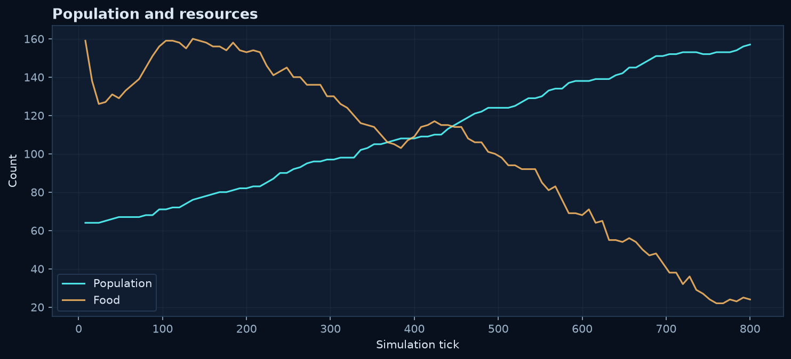

**Population and resources:** cyan counts living animals; amber counts food
patches. Both share a count axis but represent different things. Look for sustained
growth, plateaus or decline; do not infer how much food energy exists from the
number of patches alone. A plateau can include many births and deaths.

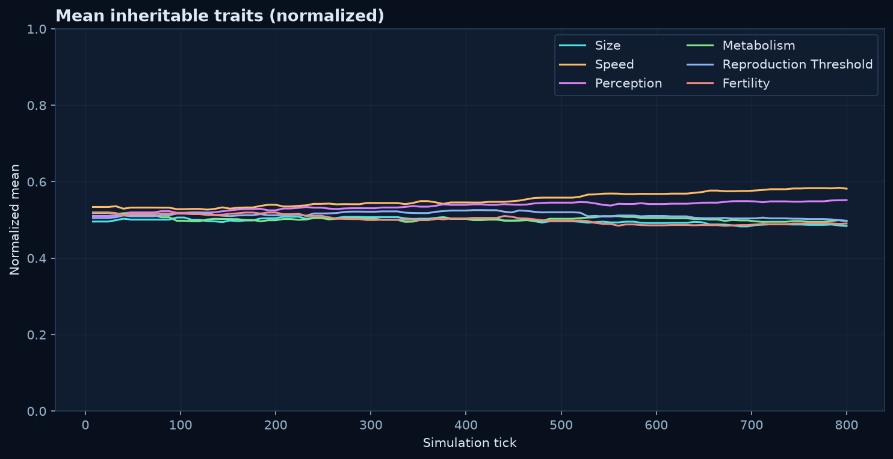

**Mean inheritable traits:** each coloured line is a different trait; the vertical
axis is its normalized mean, 0–1 within fixed configuration bounds. Follow one
line through time to see distributional shifts. Comparing normalized heights
does not compare physical units: speed, size and fertility have different meanings.
A high metabolism value is not automatically beneficial; energy costs matter.

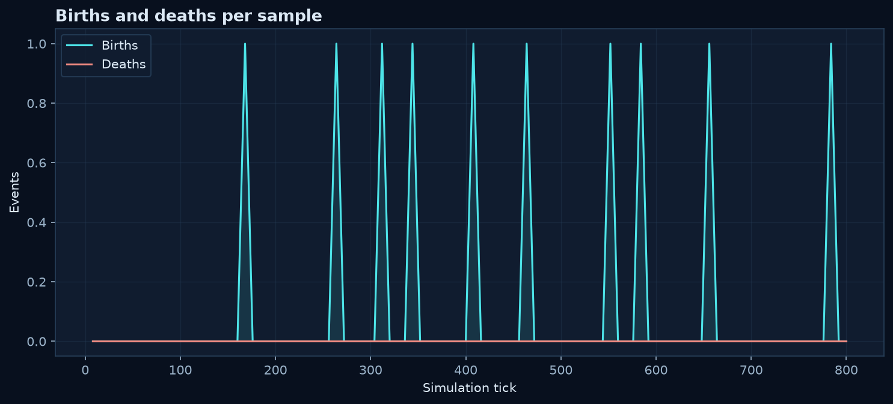

**Births and deaths:** these exported traces plot events **at the recorded sample
tick**, not cumulative totals and not sums of all events since the preceding
sample. Events between metric samples can therefore be absent from this figure.
Do not sum its points to reconstruct lifetime births/deaths. Use `total_births`
and `total_deaths` in the export summary/report for complete counts. This differs
from the desktop **Life & loss · cumulative** graph, whose totals retain outcomes
between GUI polls. For a run with no immigration, check
`living = initial founders + total births − total deaths`.

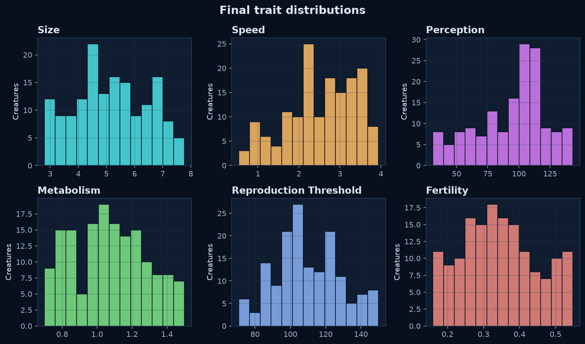

**Final trait distributions:** each panel is a histogram of one trait in the
living population at the final tick. Horizontal position is the raw trait value;
bar height is the number of animals in a bin. Wide distributions show more
spread; multiple peaks can indicate subgroups but do not establish separate
species. This is a final snapshot, not a time series, and excludes animals that
already died. Bin choices can alter the apparent shape.

### 5. Trait geometry: individual variation beyond the average

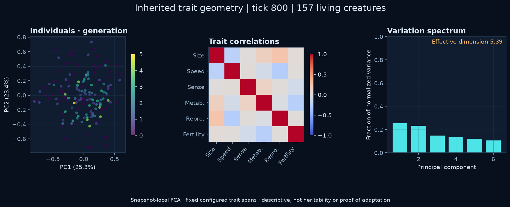

The [separately published full-size figure](docs/images/trait-geometry.png) shows
the same showcase snapshot. Read the three panels as follows:

1. **Individuals · generation:** each dot is a living creature. The horizontal
   and vertical coordinates are PC1 and PC2: weighted combinations of all six
   normalized traits, not physical position in the habitat. Nearby points have
   similar projections, but may differ in the other four dimensions. Colour
   indicates generation; the axis percentages show the variance represented.
2. **Trait correlations:** the heatmap ranges from −1 to +1. Positive values mean
   the two traits tend to be high together in this snapshot; negative values mean
   one tends to be high when the other is low. Zero means no linear association,
   not necessarily independence. A constant trait has undefined correlations.
3. **Variation spectrum:** each bar is a principal component's fraction of total
   normalized variance. Tall first bars mean variation concentrates in fewer
   directions. Effective dimension summarizes that concentration; it is neither
   the number of genes nor a measure of intelligence, fitness or heritability.

PCA is fitted separately to each snapshot. Do not connect coordinates from
different snapshots as if the axes stayed fixed. Tied axes have no unique
orientation. Correlation and generation clustering are descriptive, not proof of
selection or adaptation. [Equations and interpretation](docs/TRAIT_GEOMETRY.md).

### 6. Chromosome research preview: explicitly unreleased

These six figures were generated during development of the **opt-in diploid
biome**, seed 2026, tick 1,200. The [archived summary](docs/results/diploid-preview-2026-10-08/summary.json)
records 159 living creatures, 135 births, 40 deaths and no recorded invariant
errors. The [configuration](docs/results/diploid-preview-2026-10-08/config.json)
and [phased genotype/trait snapshot](docs/results/diploid-preview-2026-10-08/trait-space.json)
are included for inspection. This is one development run, not long-horizon
validation. The default released showcase does **not** acquire explicit
chromosomes merely by downloading these images.

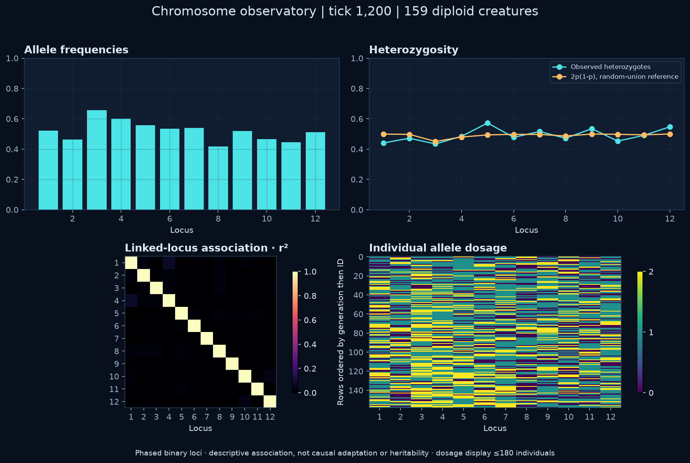

- **Allele frequencies:** the x-axis lists the 12 model loci; bar height is the
  fraction of the population's chromosome copies carrying binary allele 1.
  Each creature has two copies. Frequency 1 means fixation of allele 1; 0 means
  allele 1 is absent. Neither allele is universally “better”.
- **Heterozygosity:** cyan is the fraction of creatures with different alleles
  at a locus. Amber is `2p(1−p)`, the random-union reference at frequency `p`,
  not a claim that the population satisfies random mating or equilibrium.
  The lines can differ because actual paired copies have a different composition.
- **Linked-locus association · r²:** both axes are locus indices. The colour
  scale is 0–1 association between alleles on the sampled phased chromosomes.
  Higher values mean stronger association, not stronger causal effects on traits.
  Self-association is 1 for a variable locus; fixed loci are undefined/masked,
  not zero. Linkage, drift and population history can affect this pattern.
- **Individual allele dosage:** columns are loci and rows are creatures ordered
  by generation, then ID. The discrete colours mean 0, 1 or 2 allele-1 copies.
  Rows are not time steps or spatial positions. The display samples at most 180
  individuals deterministically; the archived snapshot retains all individuals.

<details>
<summary>All five companion figures from the same diploid preview</summary>

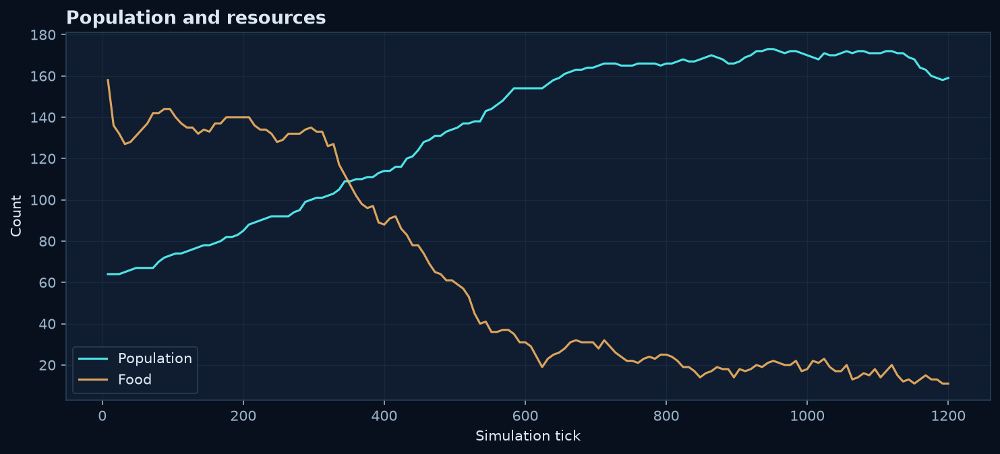

Read counts against tick exactly as in section 4; this is the chromosome-profile
run, not the showcase run. Food patches remain distinct from plant-energy reserves.

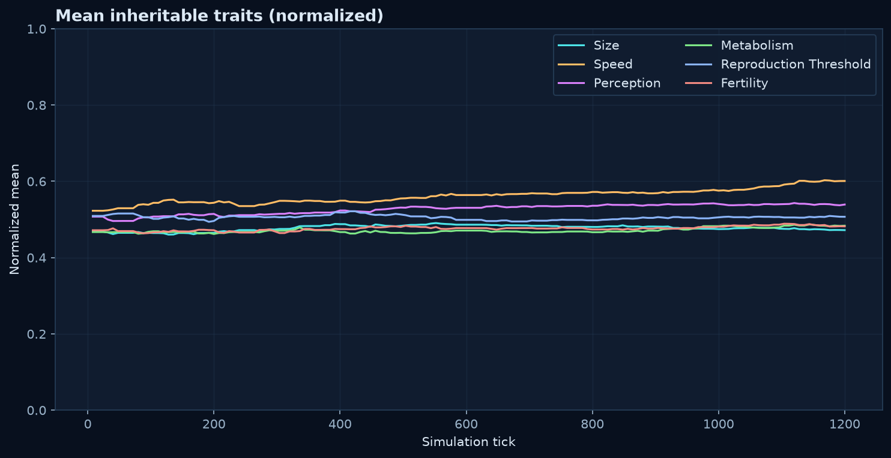

The six mean-trait lines are normalized to their configured ranges. The preview
derives traits from its chromosome architecture; these means still do not prove
adaptation or measure heritability.

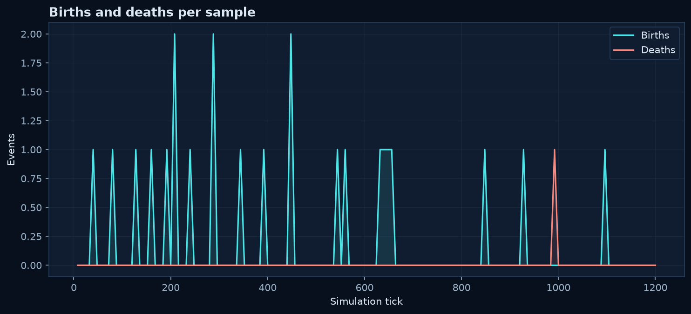

These are recorded-tick events, not cumulative totals. The summary's 135 births
and 40 deaths are the complete counts; do not replace them with a sum of points.

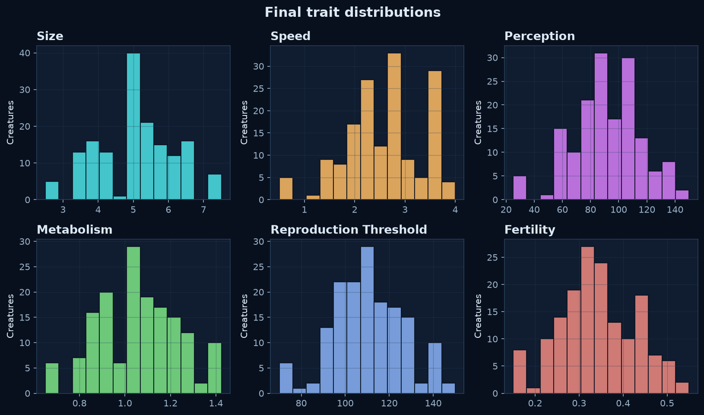

Each histogram counts surviving creatures by raw trait value at tick 1,200.
Discrete loci and shared effects can produce clustered values; this is not proof
of speciation or a calibrated real-species genetic architecture.

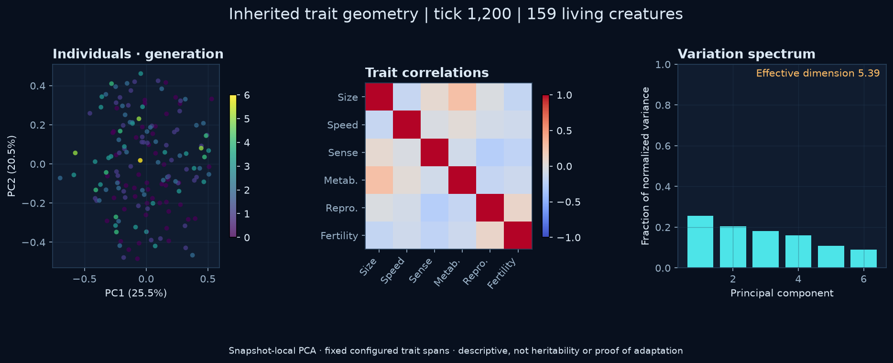

Read the PCA, correlation and spectrum panels using section 5. The axes are
fitted to this population; their coordinates are not directly comparable to the
showcase snapshot's independently fitted axes.

</details>

### 7. Screenshots: what the remaining views tell you

| Image | What to read |
| --- | --- |
| [Population overview](docs/images/presentation-overview.png) | Counts, cumulative births/deaths and energy/injury histories. A stable population need not mean no deaths. |
| [Applied storm](docs/images/presentation-storm.png) | Active intervention, exposure shading, falling population and cause-of-death totals. This is an explicitly applied storm in an older showcase, not a spontaneous event in the current study. |
| [Genetic trends](docs/images/presentation-genetics.png) | Historical living-population means and diversity. These are scalar traits, not the unreleased chromosome preview. |
| [Selected creature](docs/images/presentation-selected.png) | One animal's reserves, actions, ancestry and inherited traits alongside population histories; individual status is not a population average. |
| [Compact layout](docs/images/presentation-compact.png) | The 960×600 scrolling presentation layout; it is a layout check, not an independent experiment. |
| [Pygame laboratory](docs/images/laboratory.png) | The 2D engine observer with creatures, resources and lab controls; it is distinct from the 3D Godot client. |
| [Laboratory inspector](docs/images/inspector.png) | Selected-organism information and lineage in the 2D lab. |
| [Launch setup](docs/images/setup.png) | Configuration before starting a run, not a measured simulation result. |
| [Pressure experiment](docs/images/pressure.png) | Earlier experimental view; compare settings and source version before comparing its outcomes with current runs. |

The presentation captures are historical 2026-10-06 evidence; newer research
figures above are 2026-10-08 snapshots. [Capture conditions and historical runtime measurements](docs/PRESENTATION_VALIDATION.md).

<details>
<summary>Earlier wildlife-interface captures, retained for completeness</summary>

These show earlier UI states, not a claim that each is the latest visual design.

| Image | Meaning |
| --- | --- |
| [Overview](docs/images/wildlife-overview.png) / [1280-wide overview](docs/images/wildlife-overview-1280.png) | Whole habitat and observation panels at different window sizes. |
| [Selected animal](docs/images/wildlife-selected.png) | Individual profile and selection highlight. |
| [Instincts](docs/images/wildlife-instincts.png) | Competing normalized drive pressures, not human emotions or percentages of fitness. |
| [Action choices](docs/images/wildlife-action-choices.png) | Perceived action utilities; urgent danger and action hysteresis can override a simple highest-score interpretation. |
| [Storm](docs/images/wildlife-storm.png) | Older weather/intervention appearance. |
| [Narrow layout](docs/images/wildlife-narrow.png) | Responsive layout check, not different biology. |
| [Offline state](docs/images/wildlife-offline.png) | Disconnected-client messaging; displayed absence of a connection is not population extinction. |

</details>

<details>
<summary>Empty-population diagnostic figures</summary>

These are rendering checks, not a measured extinction treatment. They verify
that lack of living data is shown honestly.

| Figure | Interpretation |
| --- | --- |
| [Population](docs/images/empty-population/population.png) | A zero population is valid; resource counts, if present, are a separate quantity. |
| [Mean traits](docs/images/empty-population/traits.png) | There is no living-population mean to interpret after extinction; do not read an empty trace as a zero-valued genotype. |
| [Births/deaths](docs/images/empty-population/births_deaths.png) | Sampled event counts do not explain an extinction cause without a real run's complete record. |
| [Distributions](docs/images/empty-population/distributions.png) | “Population extinct” replaces a fabricated histogram. |
| [Trait geometry](docs/images/empty-population/trait_space.png) | Covariance/PCA require enough individuals and variation; unavailable is not zero correlation. |

</details>

### 8. Mathematics PDF and current references

[Open/download the 13-page Mathematics of Vikasa PDF](output/pdf/Vikasa_Mathematics_Guide.pdf).
It explains founder draws, scalar crossover/mutation, movement and boundaries,
energy, reproduction, death/environment rules, spatial lookup, summary statistics,
lineage, screen coordinates and chart normalization, with equations and worked
examples. Read the variables and configured bounds before substituting values;
illustrative defaults are not universal constants.

**Version warning:** the PDF explicitly documents commit `0140311`. It is a
historical mathematical reference, not an up-to-date specification of the newer
lifecycle, spatial reservoir, Price/PCA observers or chromosome preview. In
particular, its older death rules should not be used to explain today's showcase.
For current implemented equations use [MATHEMATICS.md](docs/MATHEMATICS.md),
[SCIENTIFIC_MODEL.md](docs/SCIENTIFIC_MODEL.md),
[spatial ecology](docs/SPATIAL_ECOLOGY.md) and
[trait geometry](docs/TRAIT_GEOMETRY.md). The PDF is preserved unchanged so its
explicit implementation version remains auditable.

### 9. Numerical reports behind the visuals

| Evidence | How to read it |
| --- | --- |
| [Showcase development study](docs/results/development-study-2026-10-08.json) | Three selected seeds, 12,000 ticks each; inspect renewal, extinction, mortality causes and recorded invariant checks together. |
| [Extinction control](docs/results/extinction-control-study-2026-10-08.json) | Preserves the earlier extinction-prone settings; compare the resolved configurations, not just the final count. |
| [Spatial study](docs/results/spatial-biome-study-6000-2026-10-08.json) | Finite-horizon spatial ecology, not indefinite viability. |
| [Weather report](docs/results/weather-laboratory-2026-10-08/report.json) / [manifest](docs/results/weather-laboratory-2026-10-08/manifest.json) | Per-seed counterfactuals, complete failed/extinct outcomes and byte hashes for the archived evidence. |
| [Spatial performance comparison](docs/results/spatial-performance-2026-10-08.json) | Measured computational throughput and seeded-state equivalence, not biological improvement. [Benchmark explanation](docs/PERFORMANCE.md). |

These reports retain their original configurations/source hashes. Later code
changes do not retroactively turn them into measurements of the latest checkout.

## Limitations

Ticks have no calibrated real-time meaning. Space is two-dimensional in the engine even when the renderer presents terrain in 3D. There is no food web, sex differentiation, genetic drift calibration, explicit disease transmission, hydrology, learned language, or validated real-species parameterization. Combat, starvation, inheritance, environment, and culture are intentionally simplified rules; plausible-looking animation does not validate them. A belief group may arise through the implemented cue/ritual rules, but users should not interpret that as the simulation independently developing human-like religion.

Additional implementation contracts live in [architecture](docs/ARCHITECTURE.md), [scientific model](docs/SCIENTIFIC_MODEL.md), and [mathematics](docs/MATHEMATICS.md). Project history and accepted current design: [wildlife experience spec](docs/superpowers/specs/2026-10-05-vikasa-wildlife-experience-design.md) and [implementation plan](docs/superpowers/plans/2026-10-05-vikasa-wildlife-experience.md).
