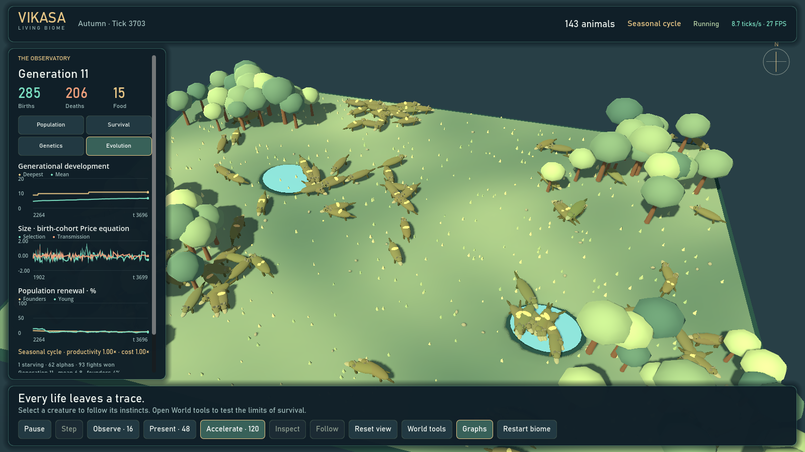
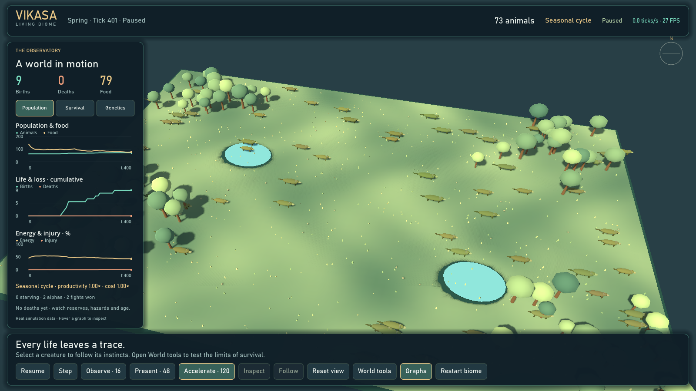
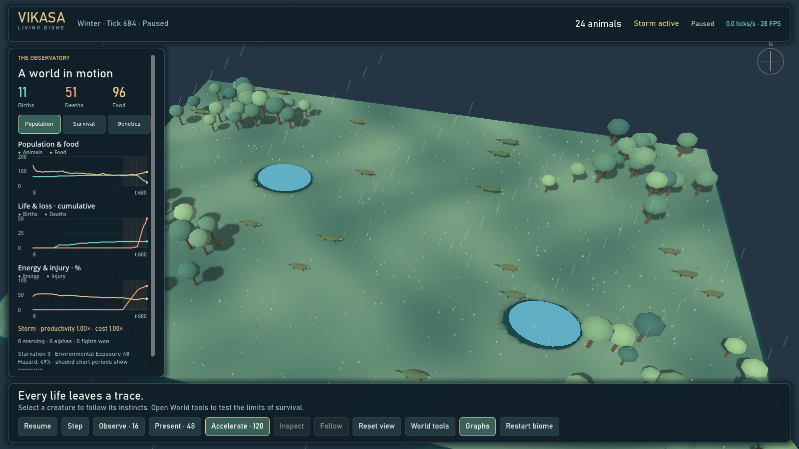
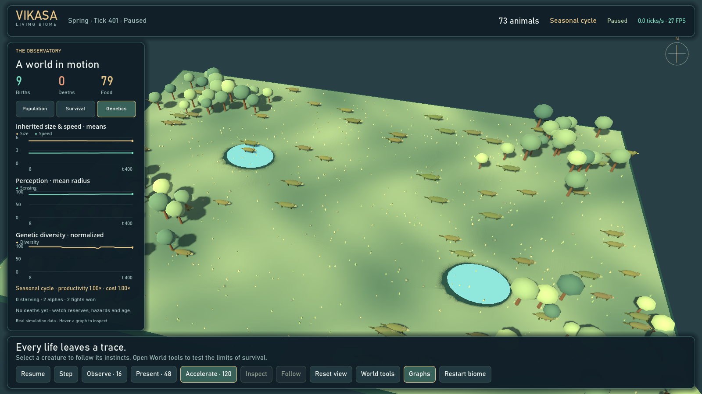
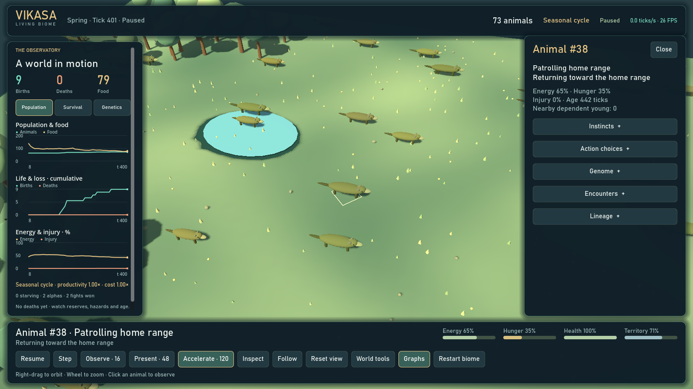

# Vikasa — Living Biome



[Compact-window screenshot](docs/images/research-evolution-compact.png). The observatory scrolls on smaller screens; unavailable legacy measurements are not plotted as zero.

The [spatial ecology research profile](docs/SPATIAL_ECOLOGY.md) adds finite plant reserves,
soil-water dynamics, an interactive cell map, and auditable natural/external food inputs.
It is available through `--config config/spatial-biome.json`; the sustained showcase
remains the default pending long-horizon validation of this new model.

The research upgrade is underway: sustained replacement, age-dependent mortality,
generational development and inspectable quantitative evolution are implemented.
See [current evidence and the full remaining scope](docs/RESEARCH_STATUS.md).

Vikasa is a deterministic artificial-life sandbox. Watch small wild creatures forage, rest, flee, seek mates, care for young, patrol a home range, and sometimes challenge a rival. Their decisions emerge from changing needs and local opportunities; the interface exposes the action and its reason so the habitat stays readable rather than becoming a wall of statistics.



The Python simulation engine is authoritative. The Godot 4 client renders a procedural 3D habitat and sends observation/control commands to a loopback-only bridge. A Pygame lab and headless CLI remain available. This is an explanatory toy model—not a forecast for a real species.

## Run the 3D Living Biome

The interactive 3D GUI runs on desktop Windows, macOS, and Linux. It requires Python 3.12 or newer, Godot 4, and a graphics-capable desktop; this repository does not currently provide an Android or iOS app. The commands below assume you already have a Vikasa source checkout and run them from its root directory (the one containing `pyproject.toml`).

### Windows (PowerShell)

Install Godot 4 if it is not already installed, then create the environment, install Vikasa, and launch the 3D client:

```powershell
winget install --id GodotEngine.GodotEngine --exact --scope user
py -3.12 -m venv .venv
.\.venv\Scripts\python.exe -m pip install --upgrade pip
.\.venv\Scripts\python.exe -m pip install -e .
.\.venv\Scripts\vikasa.exe godot --config config\showcase.json --seed 2026
```

The launcher detects a per-user WinGet Godot installation. To create or refresh a desktop shortcut for this checkout, run:

```powershell
.\.venv\Scripts\vikasa.exe shortcut --config config\showcase.json --seed 2026
```

### macOS (Terminal)

With Homebrew installed, run:

```bash
brew install python@3.12
brew install --cask godot
python3.12 -m venv .venv
source .venv/bin/activate
python -m pip install --upgrade pip
python -m pip install -e .
vikasa godot --config config/showcase.json --seed 2026 --godot-path /Applications/Godot.app/Contents/MacOS/Godot
```

### Linux (Ubuntu 24.04+, Terminal)

This copy/paste path uses Ubuntu's Python 3.12 packages and Godot's Flathub build. Run the first block once, then keep the first terminal open while the GUI runs in a second terminal:

```bash
sudo apt update
sudo apt install -y python3.12 python3.12-venv flatpak
flatpak remote-add --user --if-not-exists flathub https://flathub.org/repo/flathub.flatpakrepo
flatpak install --user -y flathub org.godotengine.Godot
python3.12 -m venv .venv
source .venv/bin/activate
python -m pip install --upgrade pip
python -m pip install -e .
```

Terminal 1 — start the simulation bridge from the repository root:

```bash
source .venv/bin/activate
vikasa serve --config config/showcase.json --seed 2026
```

Terminal 2 — from the same repository root, launch the Godot GUI:

```bash
flatpak run org.godotengine.Godot --path "$PWD/godot"
```

On other Linux distributions, install Python 3.12 (including its `venv` support) and Flatpak with that distribution's package manager, then use the same setup and two-terminal commands. Godot must be able to read the checkout's `godot/` directory. The Pygame 2D lab remains available on all three desktop platforms with `vikasa ui --config config/showcase.json --seed 2026` (Windows: `.\.venv\Scripts\vikasa.exe ui --config config\showcase.json --seed 2026`).

For direct GUI launch on Windows or macOS, the `godot` command starts the Python simulation bridge and Godot client together. If Godot is installed outside the automatic search locations, supply its executable with `--godot-path` or set `VIKASA_GODOT_BINARY`.

### Screenshots

| Live Observatory | Storm and population loss |
| --- | --- |
|  |  |

| Genetic trends | Creature profile |
| --- | --- |
|  |  |

These are real seeded bridge states, including an explicitly applied storm. See the current [960×600 layout](docs/images/presentation-compact.png). Earlier captures remain in `docs/images/` for reference.

### Observe and control

- Click a creature to open its readable profile: current action and reason, energy, hunger, injury, instincts, top action choices, genes, encounters, satisfaction, and lineage.
- Use **Follow** to track the selected animal; **Reset view** returns to the whole habitat. Right-drag orbits, and the wheel zooms.
- **Space** pauses/resumes; **Step** advances one tick while paused. **Observe · 16**, **Present · 48**, and **Accelerate · 120** request those tick rates. Present is the default; the HUD displays actual speed. Excess catch-up work is discarded on slower hardware. With the complete 3D window open, this Intel Iris Xe development laptop sustained about 43 ticks/second in a 12-second Accelerate sample; this is an example, not a guarantee for all devices.
- **Graphs** toggles the Observatory. **Population**, **Survival**, **Genetics**, and **Evolution** show real engine histories; hover to inspect values at a tick. Evolution shows generational depth, founder replacement and signed birth-cohort Price decomposition. Shaded periods show weather exposure. Birth/death totals retain outcomes between GUI polls.
- **World tools** offers drought, heat, storm, wildfire, cold, disease, a food bloom, and food placement. Adjust pressure and duration, then **Apply weather**. Drought intensity is food growth retained (lower is harsher); other hazards strengthen as intensity increases. Default duration is 160 ticks.
- **Restart biome** resets the population and histories with the same seed after an experiment or extinction.
- **Escape** cancels placement/closes a panel. The HUD reports offline state and clears stale creature data if the bridge disconnects.


The model tracks six drives—survival, foraging, mating, offspring care, danger avoidance, and territory. They are competing normalized pressures, not human feelings. Expand **Instincts** to read each one and **Action choices** to inspect the leading perceived utilities. An urgent danger can preempt the highest score; otherwise hysteresis and seeded near-tie choice reduce jitter. The exact model and its caveats are in [the scientific model](docs/SCIENTIFIC_MODEL.md) and [the mathematics reference](docs/MATHEMATICS.md).

The client uses shared meshes, one simple body shadow per visible animal, static habitat shadows, instanced vegetation, a 30 FPS ceiling, at most 180 visible creatures and 240 food patches, and bounded chart histories. The full population lives in Python; drawing alone is capped. Above 40 creatures, decisions are deterministically staggered across six ticks while movement, hunger, consumption, births and deaths advance every tick. Combat opportunities are checked every four ticks. Completed GUI snapshots publish about six times/second, so polling does not wait for a simulation tick. Diversity analysis is vectorized.

The showcase starts with 64 founders in a 720×480 habitat and a cap of 180. It uses seeded age-dependent mortality, viable feeding/encounter density and larger newborn reserves for sustained generational replacement. The 12,000-tick maximum age is a hard ceiling, not an expected lifespan. Animals still die from scarcity, fights, senescence and exposure; nothing respawns them. The previous extinction-prone configuration is preserved as `config/extinction-control.json`. See [research status and remaining work](docs/RESEARCH_STATUS.md). These coefficients remain illustrative rather than calibrated to a real species.

## Reproducible development studies

Measure renewal across seeds rather than judging one short GUI run:

```powershell
.\.venv\Scripts\python.exe -m evolution_sim.cli study --config config/showcase.json --seeds 2026 7 41 --ticks 12000 --output exports/development-study.json
.\.venv\Scripts\python.exe -m evolution_sim.cli study --config config/extinction-control.json --seeds 2026 7 41 --ticks 12000 --output exports/extinction-control-study.json
```

The report retains extinct runs, exact extinction times, generation trajectories,
invariant checks, configuration/source hashes and a Wilson survival interval.
This can take several minutes. It is exploratory evidence, not species validation.
Experiment exports also include `evolution.json` (the last 512 birth cohorts) and
generation depth in `creatures.csv`.

## Pygame laboratory

```powershell
.\.venv\Scripts\vikasa.exe ui --config config\showcase.json --seed 2026
```

The 2D laboratory has a launch configurator, presets, organism selection, traits/lineage inspection, trails, perception overlays, and charts. `Enter` launches; `Space` pauses; `1`–`5` choose 1, 2, 4, 8, or 16 ticks per rendered frame; `R` restarts with the same seed; `C` opens setup; `P` toggles perception; `T` toggles trails; `Ctrl+S` saves a checkpoint; `Ctrl+O` loads it; `E` exports; `?` or `Escape` opens help. Speed changes ticks per frame, not the equations.

## What the simulation actually includes

- Six bounded body genes, crossover, mutation, and three inherited behavioral tendencies (aggression, resilience, sociability).
- Foraging and resource competition, energy costs, accumulated starvation, aging, mating, offspring, and lineage.
- Six drives arbitrated among eight actions: explore, forage, rest, seek mate, care, flee, patrol, and challenge.
- Small home ranges, local hazard/threat perception, intermittent low-probability fights, injury, occasional fatal outcomes, and alpha status after victory.
- Satisfaction summarizes energy security, offspring history, food acquired, and fights won. Its fight-wins component modestly raises repeat-challenge utility and the still-low encounter chance; satisfaction is not a universal fitness objective.
- Seasonal food/temperature/rainfall signals and scheduled drought, abundance, heat, cold, storm, flood, wildfire, and disease pressure.
- A small cultural-tradition mechanic: repeated shared cues can found named beliefs and rituals. This is not language, theology, reflective religion, or guaranteed emergence.
- Seeded experiments, invariant audits, CSV/JSON evidence, atomic checkpoints, and a deterministic live bridge.

## Headless experiments

Validate a config, run one scenario, run seeded replicates, or perform a long invariant audit:

```powershell
.\.venv\Scripts\vikasa.exe validate --config config\showcase.json
.\.venv\Scripts\vikasa.exe run --scenario experiments\scarcity.json --output exports\scarcity --seed 2202 --ticks 7000
.\.venv\Scripts\vikasa.exe batch --scenario experiments\mutation_high.json --output exports\mutation-high --replicates 5 --ticks 6000
.\.venv\Scripts\vikasa.exe stress --config config\showcase.json --ticks 100000 --seed 2026
```

All commands accept `--help`. Scenario/config files are the protocol; use matched settings and multiple seeds before interpreting a treatment. Read [experiment recipes](docs/EXPERIMENTS.md) and [the demonstration walkthrough](docs/DEMO_SCRIPT.md).

## Limitations

Ticks have no calibrated real-time meaning. Space is two-dimensional in the engine even when the renderer presents terrain in 3D. There is no food web, sex differentiation, genetic drift calibration, explicit disease transmission, hydrology, learned language, or validated real-species parameterization. Combat, starvation, inheritance, environment, and culture are intentionally simplified rules; plausible-looking animation does not validate them. A belief group may arise through the implemented cue/ritual rules, but users should not interpret that as the simulation independently developing human-like religion.

Additional implementation contracts live in [architecture](docs/ARCHITECTURE.md), [scientific model](docs/SCIENTIFIC_MODEL.md), and [mathematics](docs/MATHEMATICS.md). Project history and accepted current design: [wildlife experience spec](docs/superpowers/specs/2026-10-05-vikasa-wildlife-experience-design.md) and [implementation plan](docs/superpowers/plans/2026-10-05-vikasa-wildlife-experience.md).
